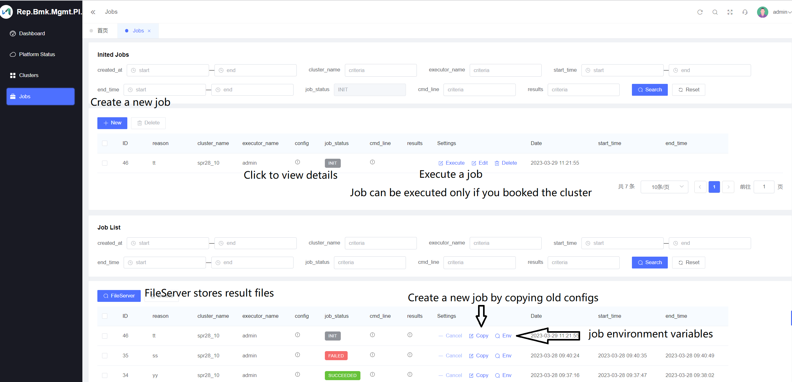

<div align=center>


</div>

# Project Guidelines

## 1. Basic Introduction

### 1.1 Project Introduction

> Reproducible-Benchmarking-Management-Platform is a backstage management system based on [Gin-vue-admin](https://www.gin-vue-admin.com), which commits to establishing a reusable and easy-to-use benchmarking platform.


[Website](http://yongfeng-desk.bj.intel.com:8080/): http://yongfeng-desk.bj.intel.com:8080/

username：firstname.lastname (e.g. yehao.li)

password：firstname.lastname

## 2. How to use

### 2.0 Dashboard
Dashboard (Main Page)


### 2.1 Clusters
Cluster Booking


### 2.2 Jobs
Job Dispatch and History


Job Env


### 2.3 Management (for admin)
Cluster Management (add new clusters, delete clusters)


Misc. (user, permission, menu, api, etc.)


## 3. Development

```
- node version > v8.6.0
- golang version >= v1.14
```

### 3.1 Frontend

```bash
# enter the project directory
cd web

# develop
npm run serve
```

### 3.2 Backend

```bash
# enter the project directory
cd server

# develop
go run main.go

# warning: restarting the backend is required if the code is modified
```
